# C4 Диаграммы: BFF

Ниже приведены описания C4-диаграмм (уровни 3 и 4) для BFF. Для текстовых диаграмм используется нотация PlantUML.

## Уровень 3 — Компоненты фронтенд-BFF (Next.js SSR + API)

```plantuml
@startuml
!include https://raw.githubusercontent.com/plantuml-stdlib/C4-PlantUML/master/C4_Component.puml

title Компоненты BFF Фронтенда

Person(user, "Пользователь", "Браузер, отправляющий форму входа и получающий cookies")

System_Boundary(bff, "BFF ВОблако", "Next.js (App Router, SSR)", "Серверный рендеринг страниц и API-маршруты, работающие как прокси") {
    Component(route_login, "Route Handler /api", "TypeScript / Next.js API Route", "Обрабатывает HTTP-запросы и перенаправляет их в бэкенд через BFF")
    Component(remote_proxy, "Remote API Proxy", "TypeScript fetch", "Форвардит HTTP-запрос к удалённому API, удаляя hop-by-hop заголовки")
    Component(session_utils, "Session Cookie Utils", "TypeScript", "Пробрасывает/очищает session cookies на ответе")
    Component(api_config, "API Target Config", "TypeScript", "Читает env, определяет remote target и базовый URL")
    Component(ssr_renderer, "SSR Renderer", "React/Next.js", "Отдаёт HTML-страницы клиенту, используя данные core-бэкенда")
}

System_Ext(remote_api, "API Gateway", "HTTP", "Единая точка доступа для core-бэкенда")

Rel(user, route_login, "REST /api (JSON + cookies)")
Rel(user, ssr_renderer, "GET / (HTML, assets)")
Rel(route_login, remote_proxy, "forwardToRemoteApi(request)")
Rel(remote_proxy, api_config, "isRemoteApiEnabled, buildRemoteApiUrl")
Rel(remote_proxy, remote_api, "HTTP proxy", "fetch")
Rel(route_login, session_utils, "Проставляет Set-Cookie из ответа")
Rel(route_login, user, "Response/ErrorResponse + Set-Cookie", "HTTP 200/4xx")

@enduml
```

**Описание:** Фронтенд работает как полноценный BFF на Next.js. Он рендерит страницы (SSR) и предоставляет API-маршруты, которые форвардят запросы в единый `API Gateway` core-бэкенда через `Remote API Proxy`, опираясь на конфигурацию окружения и корректно обрабатывая cookies.

## Уровень 4 — Диаграмма кода (структура модулей)

```plantuml
@startuml
title Структура кода /api (BFF Next.js)

skinparam class {
    BackgroundColor #F2F2F2
    BorderColor #707070
}
skinparam package {
    BorderColor #707070
}

package "Service: Auth\n(app/api/auth)" {
    class AuthLoginRoutes {
        + POST(request: NextRequest): Promise<NextResponse>
        - parseLoginBody(request: NextRequest): Promise<LoginRequest | null>
    }
    class AuthSignupRoutes {
        + POST(request: NextRequest): Promise<NextResponse>
        - parseSignupBody(request: NextRequest): Promise<SignupRequest | null>
    }
    class AuthLogoutRoutes {
        + POST(request: NextRequest): Promise<NextResponse>
    }
    class AuthCheckRoutes {
        + GET(request: NextRequest): Promise<NextResponse>
    }
}

package "Service: Files\n(app/api/files)" {
    class FilesRootRoutes {
        + POST(request: NextRequest): Promise<NextResponse>
    }
    class FilesListRoutes {
        + POST(request: NextRequest): Promise<NextResponse>
    }
    class FilesItemRoutes {
        + GET(request: NextRequest, context: RouteContext): Promise<NextResponse>
        + POST(request: NextRequest, context: RouteContext): Promise<NextResponse>
        + DELETE(request: NextRequest, context: RouteContext): Promise<NextResponse>
    }
}

package "Service: Storage\n(app/api/storage)" {
    class StorageRoutes {
        + GET(request: NextRequest): Promise<NextResponse>
        + POST(request: NextRequest): Promise<NextResponse>
        + DELETE(request: NextRequest): Promise<NextResponse>
    }
}

package "app/api/utils" {
    class RemoteProxy {
        + forwardToRemoteApi(request: NextRequest, overridePath?): Promise<NextResponse>
        - buildForwardHeaders(request: NextRequest): Headers
        - applyResponseHeaders(source: Headers, target: NextResponse)
    }
}

package "app/config" {
    class ApiTargetConfig {
        + isRemoteApiEnabled(): boolean
        + buildRemoteApiUrl(path?): string
        - apiConfig: ApiConfig
    }
}

package "next/server" {
    class NextRequest
    class NextResponse
}

AuthLoginRoutes ..> RemoteProxy : использует\nforwardToRemoteApi()
AuthSignupRoutes ..> RemoteProxy : использует
AuthLogoutRoutes ..> RemoteProxy : использует
AuthCheckRoutes ..> RemoteProxy : использует
FilesRootRoutes ..> RemoteProxy : использует
FilesListRoutes ..> RemoteProxy : использует
FilesItemRoutes ..> RemoteProxy : использует
StorageRoutes ..> RemoteProxy : использует
RemoteProxy ..> ApiTargetConfig : использует\nisRemoteApiEnabled(), buildRemoteApiUrl()
AuthLoginRoutes ..> NextRequest : принимает
AuthSignupRoutes ..> NextRequest : принимает
AuthLogoutRoutes ..> NextRequest : принимает
AuthCheckRoutes ..> NextRequest : принимает
FilesRootRoutes ..> NextRequest : принимает
FilesListRoutes ..> NextRequest : принимает
FilesItemRoutes ..> NextRequest : принимает
StorageRoutes ..> NextRequest : принимает
AuthLoginRoutes ..> NextResponse : возвращает/модифицирует
AuthSignupRoutes ..> NextResponse : возвращает/модифицирует
AuthLogoutRoutes ..> NextResponse : возвращает/модифицирует
AuthCheckRoutes ..> NextResponse : возвращает/модифицирует
FilesRootRoutes ..> NextResponse : возвращает/модифицирует
FilesListRoutes ..> NextResponse : возвращает/модифицирует
FilesItemRoutes ..> NextResponse : возвращает/модифицирует
StorageRoutes ..> NextResponse : возвращает/модифицирует
RemoteProxy ..> NextResponse : создает ответ

@enduml
```



**Описание:** Каждая папка в `app/api` трактуется как класс с методами, соответствующими HTTP-ручкам. Для области `storage` явно показаны операции `GET/POST/DELETE`, чтобы продемонстрировать паритет с файловым сервисом. Пакеты подписаны как отдельные сервисы (Auth, Files, Storage), что визуально разделяет уровни BFF. Все сервисы используют общий `RemoteProxy`, завязанный на `ApiTargetConfig` и типы Next.js, — тем самым BFF проксирует все домены к API Gateway core-бэкенда.
