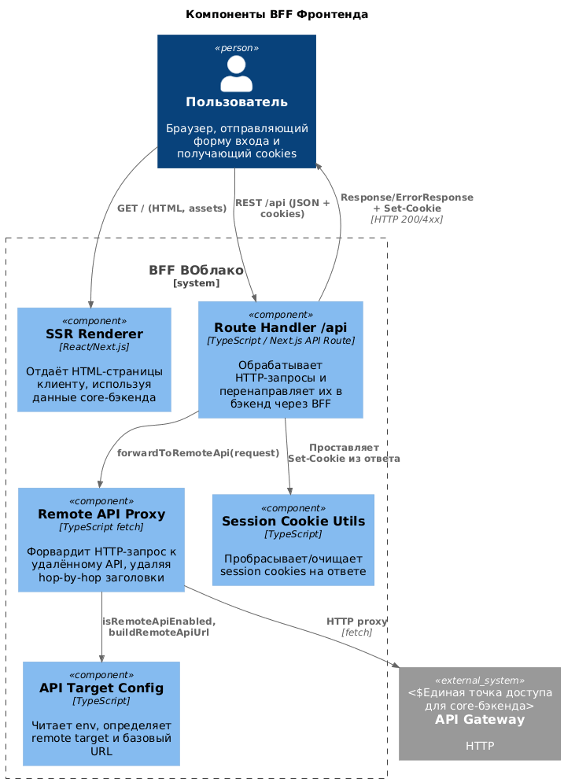
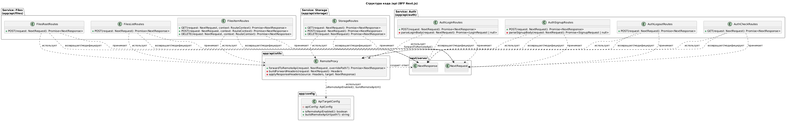

# Отчёт по проекту VOblako (Frontend + BFF)

## Постановка задачи
- Создать фронтенд для облачного хранилища VOblako, работающий в режиме BFF (Next.js App Router + API routes).
- Обеспечить аутентификацию, просмотр файлов/папок, загрузку и управление файлами, в том числе в mock-режиме без внешнего бэкенда.
- Сформировать удобное UI-оболочку с адаптивным layout и интегрировать BFF-ручки с серверной частью через прокси.

## Цели и задачи
- Реализовать BFF-слой на Next.js, который:
  - Рендерит защищённые страницы (SSR) и обслуживает клиентские запросы.
  - Проксирует запросы к внешнему API Gateway либо использует локальные моки.
  - Управляет сессией через HTTP-only cookies.
- Покрыть API-маршруты и UI-компоненты тестами (Vitest + Testing Library).
- Обеспечить возможность контейнерной сборки и работы mock-данных внутри образа.

## Краткое описание решения
- Next.js 16 (App Router) выступает как BFF: серверный рендеринг и API-handlers в `app/api/*`.
- Режимы работы:
  - `VOBLAKO_API_TARGET=remote` — прокси в удалённый API Gateway через `forwardToRemoteApi`.
  - `VOBLAKO_API_TARGET=mock` — обработка файлов/хранилища/авторизации в памяти с начальным seed’ом и мок-файлами, включёнными в Docker-образ.
- UI: адаптивный protected layout, интерактивная сетка файлов, drag&drop загрузка, диалоги загрузки и предпросмотра.
- Тесты: покрыты API (auth/files/storage), layout-компоненты и загрузочные виджеты; добавлена команда `npm run test:coverage`.

## Архитектурные схемы (C4)

### Общая схема (контекст/компоненты)

### Кодовый уровень (BFF и UI-модули)

## Итоги
- Реализован BFF на Next.js с переключаемыми режимами mock/remote и корректной работой cookies.
- Макеты и загрузочные сценарии протестированы, мок-файлы включены в Docker-образ.
- Добавлены команды тестов и покрытия, обеспечивающие базовую регрессионную гарантию для API и UI слоёв.
